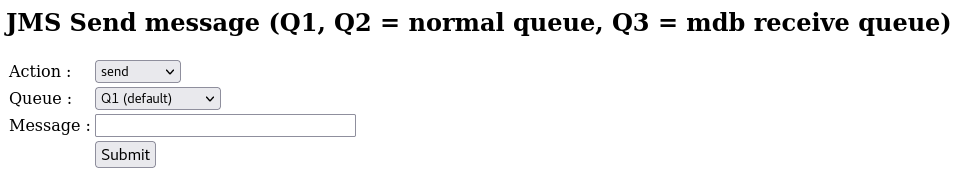

# MustGather Hands-On JMS case 

## Start jms container on docker or openshift

Follow steps described at parent folder's README 

You can chose JMS Server (MQ, SIBus, Active MQ)

## Access to the servlet to test jms operation send/receiveAll

Access to following URL by your browser

- http://localhost:9080/jms/

Please use select menu, target queue and push buttons to test jms operation you wanted

You can check that behavior with websphere trace.

You can use Q1 and Q2 for normal JMS operation

Q3 is monitored by MDB. So, put message will be received by MDB. Please check messages.log to check that action.

